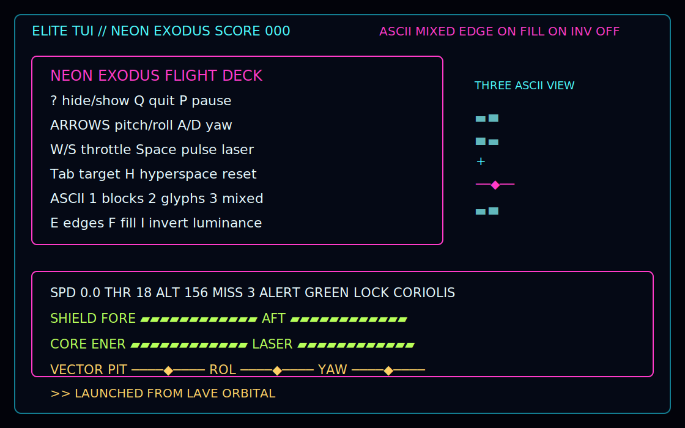
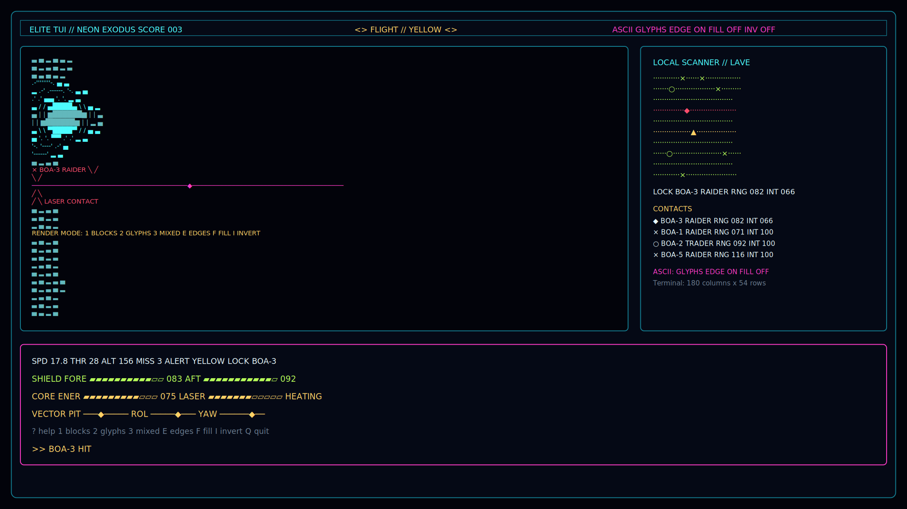
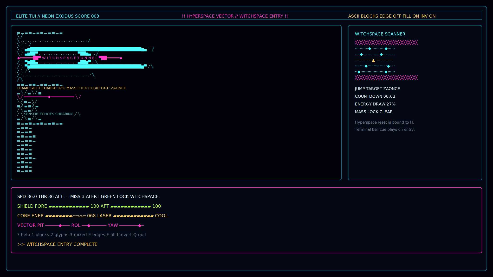
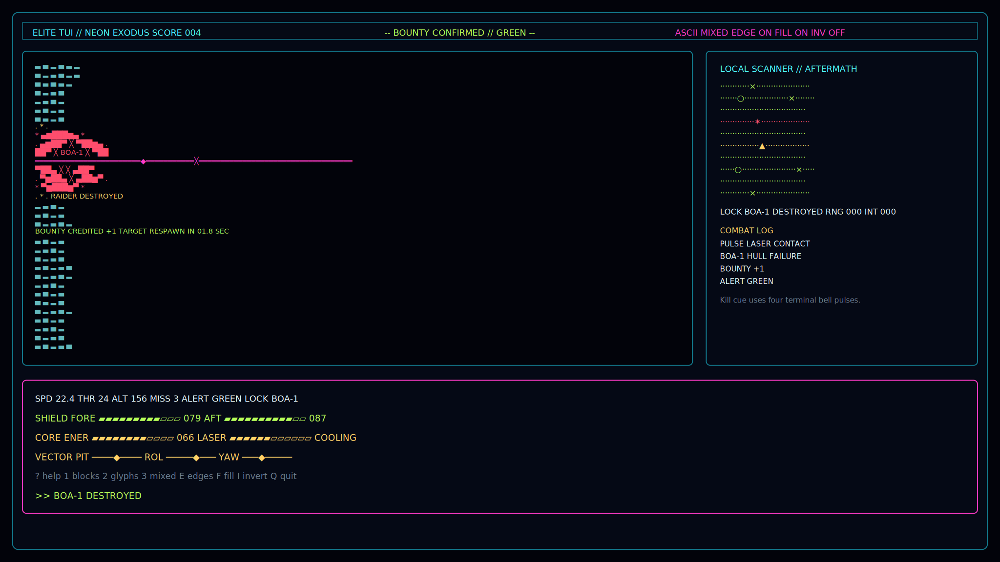

# Elite TUI

A clean-room Elite-inspired terminal flight demo built with Deno, Three.js, and the local `deno_tui` Three ASCII
renderer.

<figure>
  
  <figcaption>Docking approach with Coriolis station alignment, scanner contacts, and flight telemetry. <a href="assets/screenshots/cockpit-help.svg">Open full size</a>.</figcaption>
</figure>

<figure>
  
  <figcaption>Combat view with a target lock, laser contact, hull breach, scanner contacts, and ASCII render mode. <a href="assets/screenshots/scanner-render-options.svg">Open full size</a>.</figcaption>
</figure>

<figure>
  
  <figcaption>Hyperspace jump with witchspace tunnel, scanner disruption, and energy draw. <a href="assets/screenshots/hyperspace-jump.svg">Open full size</a>.</figcaption>
</figure>

<figure>
  
  <figcaption>Bounty aftermath with a destroyed raider, debris bloom, score update, and combat log. <a href="assets/screenshots/bounty-destroyed.svg">Open full size</a>.</figcaption>
</figure>

Run it with:

```sh
deno task start
```

Controls:

- Arrow keys: pitch and roll
- `A` / `D`: yaw
- `W` / `S`: throttle
- Space: pulse laser
- `Tab`: cycle target
- `H`: hyperspace reset
- `P`: pause
- `?`: show or hide help
- `1` / `2` / `3`: switch ASCII blocks, glyphs, or mixed mode
- `E` / `F` / `I`: toggle edges, fill, or inverted luminance
- `Q`, `Esc`, or `Ctrl+C`: quit

Sound effects use terminal bell cues for laser fire, locks, hits, kills, hyperspace, pause, and control toggles. Disable
them with:

```sh
ELITE_TUI_SOUND=0 deno task start
```

The scanner panel appears when the terminal has enough width and height; compact terminals prioritize the flight view,
help overlay, and dashboard.

The code intentionally does not copy NES Elite source, ROM, image, or ship data. It uses procedural Three.js geometry
and a local vendored snapshot of `deno_tui`.
