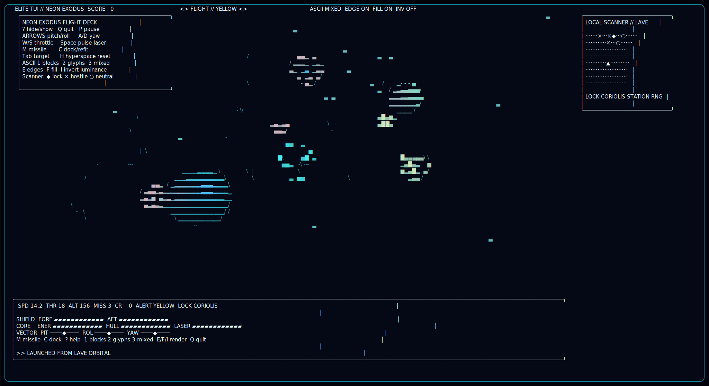
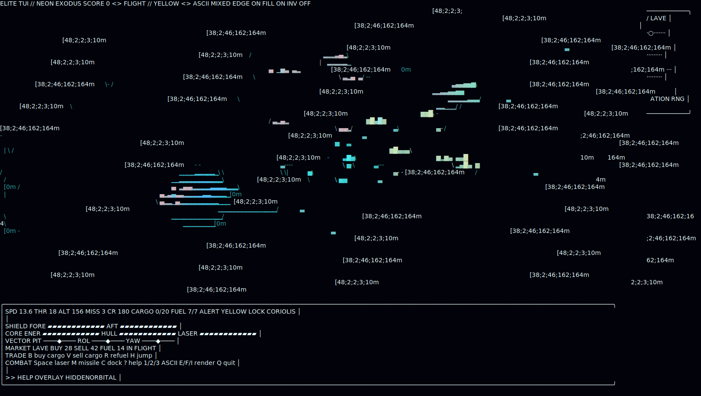
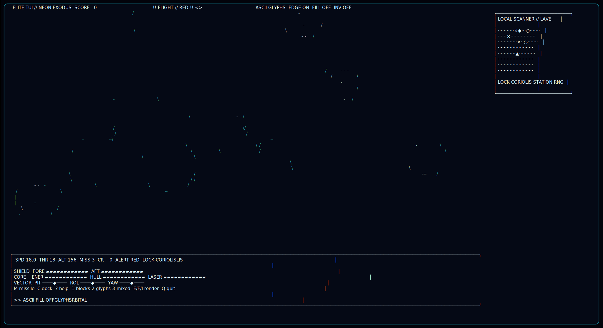
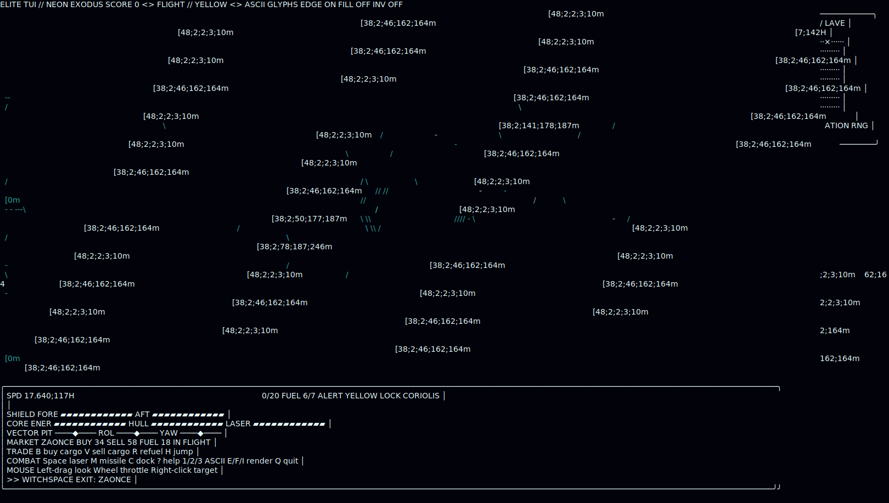

# Elite TUI

A clean-room Elite-inspired terminal flight demo built with Deno, Three.js, and the local `deno_tui` Three ASCII
renderer.

<figure>
  
  <figcaption>Real 180x54 terminal capture from <code>deno task start</code>: startup help overlay, live Three ASCII scene, scanner, and dashboard. <a href="assets/screenshots/startup-help.svg">Open full size</a>.</figcaption>
</figure>

<figure>
  
  <figcaption>Real 180x54 terminal capture after hiding help: flight view, scanner contacts, target readout, and dashboard telemetry. <a href="assets/screenshots/flight-scanner.svg">Open full size</a>.</figcaption>
</figure>

<figure>
  
  <figcaption>Real 180x54 terminal capture after switching ASCII glyph mode and toggling fill rendering. <a href="assets/screenshots/render-options.svg">Open full size</a>.</figcaption>
</figure>

<figure>
  
  <figcaption>Real 180x54 terminal capture after pressing <code>H</code> for hyperspace reset. <a href="assets/screenshots/hyperspace-reset.svg">Open full size</a>.</figcaption>
</figure>

Run it with:

```sh
deno task start
```

Controls:

- Arrow keys: pitch and roll
- `A` / `D`: yaw
- `W` / `S`: throttle
- Space: pulse laser
- `M`: fire missile
- `Tab`: cycle target
- `C`: dock and refit when locked on the station at low speed
- `H`: hyperspace reset or reboot after hull breach
- `P`: pause, or launch after docking
- `?`: show or hide help
- `1` / `2` / `3`: switch ASCII blocks, glyphs, or mixed mode
- `E` / `F` / `I`: toggle edges, fill, or inverted luminance
- `Q`, `Esc`, or `Ctrl+C`: quit

Sound effects use terminal bell cues for laser fire, locks, hits, kills, hyperspace, pause, and control toggles. Disable
them with:

```sh
ELITE_TUI_SOUND=0 deno task start
```

The scanner panel appears when the terminal has enough width and height; compact terminals prioritize the flight view,
help overlay, and dashboard.

Hostile raiders now return fire when they close to weapon range. Keep shields up, manage laser heat, use missiles for
quick kills, and dock at the Coriolis station to restore hull, shields, energy, heat, and missile stores.

The code intentionally does not copy NES Elite source, ROM, image, or ship data. It uses procedural Three.js geometry
and a local vendored snapshot of `deno_tui`.
